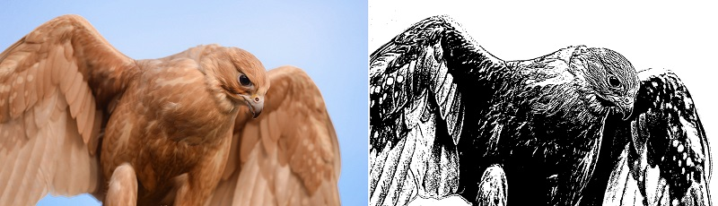

# XDoG-Python
Python command-line implementation of XDoG Image filter modeled after [CenalUnal's Matlab implementation](https://github.com/CemalUnal/XDoG-Filter).

Relies on Numpy, PIL and Scipy.

Run with commands:
```
-i or --input : input image file path
-o or --output : output image file path
-p or --params : XDoG parameters in the following order: gamma, phi, epsilon, k, sigma (default is 0.98, 200, -0.1, 1.6, 0.8)
```
Command line example:
```
python XDoG.py -i ./input.png -o ./output.png -p 0.98, 200, -0.1, 1.6, 0.8
```
Note: Script will save out an output file in the same location as the input file with "-out.png" appended to the name if an output file name is not provided (overwriting current if exists).


